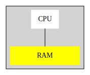
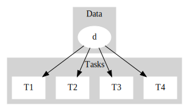
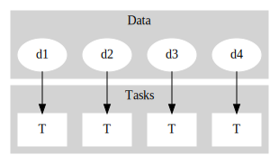
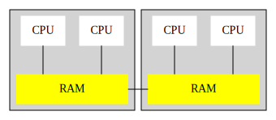
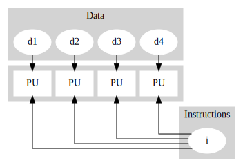
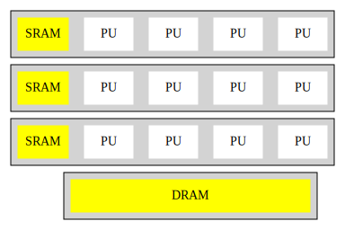
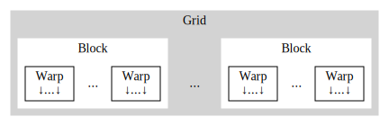
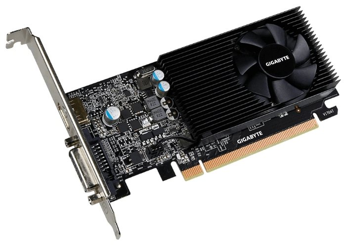
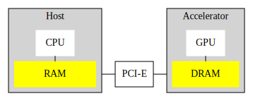
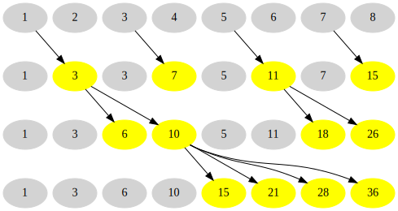

<!-- _paginate: false -->
<!-- _class: lead -->

# Распараллеливание массовых вычислений

</br>

## С.А.Романенко</br>

ИПМ им. М.В. Келдыша РАН, Москва<br/>
28 февраля 2021

---

<!-- _class: lead -->

## Появление новых типов вычислительных устройств<br/>:sunrise:

<br/><br/><br/>

---

## Застой в информатике

В информатике наблюдался застой где-то с середины
70-х годов.

**Причины**:

- Безраздельно доминировал один тип вычислительных устройств:
  фон-неймановская машина (ФНМ).

- Необычайная гибкость фон-неймановской машины делала жизнь
программистов слишком лёгкой.

---

## Специфические свойства ФНМ (1)



- Последовательное исполнение команд.
- Большая и однородная память.
- Данные неподвижно лежат в том месте, куда их положили.

---

## Специфические свойства ФНМ (2)

- Последовательное исполнение команд.
  - Нет проблем с синхронизацией. Если надо решить 2 задачи, то
    решаем сначала 1-ю, а потом -- 2-ю (или наоборот).

- Большая и однородная память.
  - Из любой части программы можно в любой момент "протянуть руку" к любому
    месту памяти.
  - Данные неподвижно лежат в том месте, куда их положили. Поэтому,
    одни данные могут ссылаться на другие. А с помощью ссылок можно
    создавать сложные структуры данных (списки, деревья).

---

## Виды параллелизма

Параллелизм, это когда **много задач решаются одновременно**.

Два основных варианта:

- Данные - общие, задачи - разные.

- Данные - разные, задача - одна и та же. (= **"Массовый"
  параллелизм.**)

(Конечно, это - упрощенная картина.)

---

## Разнородные задачи



Для одних и тех же данных одновременно решается много
**_разных_** задач.

(Пример - параллельная обработка многих несвязанных запросов к базе данных.)

---

## Однородные задачи



**_Одна и та же_** задача решается для разных данных
  (**_массовый_** параллелизм).

(Пример - повышение резкости изображения, когда одни и те же
действия выполянются для каждой точки изображения.)

---

## Параллельные вычислители

- Многопроцессорность (multiprocessing).
  - Много процессоров (на плате или в шкафу).
  - Память у процессоров, может быть, общая, а, может быть,
    и нет.
- Многоядерность (multi-core processsor).
  - Несколько процессоров (ядер) в одном чипе.
  - Память для всех ядер - общая.
- Векторность (SIMD = single instruction, multiple data).
  - Одна команда может исполняться над несколькими данными.

---

## Многопроцессорность (multiprocessing)



- Много процессоров (на плате или в шкафу).
- Память у процессоров, может быть, общая, а, может быть,
  и нет.

---

## Векторность (SIMD)

SIMD = single instruction, multiple data).



- Одна команда может исполняться над несколькими данными.

---

## Графический процессор (ГП, GPU)



- Много-много процессоров (PU), разбитых на группы,
  у каждой из которых есть своя быстрая память (SRAM = shared RAM).
- И есть общая для всех память (DRAM).

---

<!-- _class: lead -->

## Графический процессор -<br/>это<br>"суперкомпьютер для бедных"<br/>:grin:

<br/><br/><br/>

---

## ГП: много-много нитей (threads)



Grid -> Block -> Warp -> Thread

- Решётка (grid) состоит из блоков.
- Блок (block) состоит из жгутов/пучков.
- Жгут (warp) состоит из нитей.

> Чем ниже по иерархии, тем **более тесное** взаимодействие
  возможно между нитями!

---

## ГП: зачем нужна иерархия для нитей? (1)

### Блоки

- Внутри блока возможна синхронизация нитей (барьеры).
- Внутри блока нити могут работать с быстрой общей
  (shared) памятью.

---

## ГП: зачем нужна иерархия для нитей? (2)

### Жгуты

- Все нити внутри жгута исполняют одну и ту же команду
  (SIMT = single instruction - multiple threads).
  Но некоторые нити при этом могут простаивать.
- Не нужно барьерная синхронизация внутри жгута, поскольку
  управление для всех нитей и так движется синхронно.

---

## ГП: Nvidia GeForce GT 1030

 ~7000 ₽



---

## ГП: Nvidia GeForce GT 1030 (specs)

<style scoped>
  td {
    font-size: 0.80em;
    color: green;
  }
</style>

&nbsp;                        | &nbsp;
------------------------------|----------------
Device Name                   | GeForce GT 1030
Number of Multiprocessors     | 3
Max Threads Per SMP           | 2048
Maximum Threads per Block     | 1024
Warp Size                     | 32
Global Memory Size            | 2095251456
Total Constant Memory         | 65536
Total Shared Memory per Block | 49152
Registers per Block           | 65536
L2 Cache Size                 | 524288 bytes

---

## ГП - это "микро-супер-компьютер"!

- "Блоки" соответствуют "узлам".
- "Жгуты" соответствуют "процессорам" с векторными операциями
  (SIMD).

Результат - "демократизация" массового параллелизма.

Пример: компьютерная томография. Раньше это было нечто элитарное
(требовался суперкомпьютер), а теперь томограф - это шататное
оборудование...

---

## А как же программируемая логика (ПЛИС, FPGA)?

А дело в том, что ПЛ, это **не архитектура**, а **средство
реализации** различных архитектур.

- Реализовать архитектуру можно только если она уже придумана.
- Если взять одну из известных архитектур, то для неё уже есть
  готовые реализации.
- Но можно придумать новую, неслыханную архитектуру - и реализовать
  прототип с помощью ПЛ. А потом - заказать чипы.

---

## Недостатки ПЛ с точки зрения программиста

- Изобретение новых архитектур - это не программирование,
  а несколько иная специальность.
- А если использовать известную архитектуру, то реализовывать
  её через ПЛ - нецелесообразно (дорого и медленно работает).
- Компиляция программ для известных архитектур происходит
  за секунды, а синтез схем для ПЛ может тянуться часами.
  (Нечеловеческие условия работы... :grimacing:)

---

## Почему жить стало интереснее?

- Изменилась "система ценностей" в теории сложности вычислений.
  - Раньше цель состояла в уменьшении числа операции (что
    автоматически уменьшало время выполнения). А теперь,
    время выполнения и число операций (= затраты электроэнергии) -
    не одно и то же.
- Методы и алгоритмы, которые являются "хорошими" при
  последовательных вычислениях, не обязательно являются таковыми
  в случае параллельных вычислений.

---

## Что можно "распараллеливать"?

- **Программу.**
  - Вставляем директивы для компилятора.
  - **Реорганизуем** программу.

- **Алгоритм.**
  - Выявляем скрытый параллелизм.
  - **Заменяем на другой алгоритм.**

- **Метод.**
  - Изменяем или **заменяем** метод.

---

<!-- _class: lead -->

## Как программировать "параллельно"<br/>:question:

<br/><br/><br/>

---

# Средства программирования для ГП NVIDIA

- **CUDA Toolkit**.
  - <https://developer.nvidia.com/cuda-toolkit>
  - C/C++ с расширениями (дополнительными ключевыми словами).
- **OpenACC** (часть NVIDIA HPC SDK).
  - <https://developer.nvidia.com/openacc>
  - C/C++ с директивами `#pragma acc`. Можно компилировать
    программу игнорируя эти директивы и исполнять программу
    на обычном ЦП.

---

## Взаимодействие ЦП и ГП



- ЦП работает с RAM.
- ГП работает с DRAM.
  - DRAM - быстрее, чем RAM, но меньше.
- Данные переходится пересылать между RAM и DRAM.

---

## Пересылка данных между RAM и DRAM

### CUDA

```cpp
size_t size = numElements * sizeof(int);
int *h_a = (int *) malloc(size);
cudaMalloc(&d_a, size);
cudaMemcpy(d_a, h_a, size, cudaMemcpyHostToDevice);
cudaMemcpy(h_a, d_a, size, cudaMemcpyDeviceToHost);
```

### OpenACC

```cpp
int *a = new int[numElements];
#pragma acc enter data copyin(a[0:numElements])
#pragma acc exit data copyout(a[0:numElements])
```

---

<!-- _class: lead -->

## Использование CUDA

### <https://developer.nvidia.com/cuda-toolkit>

<br/><br/><br/>

---

## Задача - сложение векторов

```cpp
void vector_add_cpu(int const n,
    int const *a, int const *b, int *r) {
  for (int i = 0; i < n; i++)
    r[i] = a[i] + b[i];
}
```

Хорошо поддаётся распараллеливанию. Почему?

- i-й проход цикла **не использует** результаты работы предыдущих
  проходов цикла!
- ⟹ Все проходы цикла можно выполнять в **произвольном
  порядке**.
- ⟹ Все проходы цикла можно исполнять **одновременно**.

---

## CUDA. Cложение векторов - ядро

- Исполнение цикла в CUDA - каждый проход цикла исполняется
  с помощью отдельной нити.
- Порядок исполнения нитей - произвольный.
- Ядро может запросить номер своей нити.

```cpp
__global__
void vector_add_kernel(int const n,
    int const *a, int const *b, int *r) {
  int i = threadIdx.x + blockDim.x * blockIdx.x;

  if (i < n) {
    r[i] = a[i] + b[i];
  }
}
```

---

## CUDA. Работа с номером нити

```cpp
  int i = threadIdx.x + blockDim.x * blockIdx.x;

  if (i < n) {
    ...
  }
```

- `threadIdx.x` - номер нити внутри блока.
- `blockIdx.x` - номер блока.
- `blockDim.x` - размер блока

**Вопрос.** Зачем нужна проверка `i < n`?

**Ответ.** Число нитей = `blockDim.x * gridDim.x`,
и может быть **больше** `n`.

---

## CUDA. Запуск нитей

```cpp
void vector_add_gpu(int const n,
    int const *a, int const *b, int *r) {
  int TPB = 256; // Threads per block.
  int BPG = (n + TPB - 1) / TPB; // Blocks per grid
  vector_add_kernel<<<BPG, TPB>>>(n, a, b, r);
}
```

- Запускаем `BPG` блоков, в каждом из которых - `TPB` нитей.
- Выражение `(n + TPB - 1) / TPB` - это вычурный способ выполнить
  "деление с округлением вверх". Например:  
  (257 + 256 - 1) / 256 = 512 / 2 = 2.

---

## CUDA. Достоинства

- Можно программировать на широкоизвестном C/C++.
- Последовательная программа довольно легко переделывается в
  CUDA-программу (если она **уже является** параллельной по сути).
- Можно учитывать тонкие свойства "железа" и использовать
  операции низкого уровня.

---

## CUDA. Недостатки

- Приходится работать в понятиях, отражающих устройство "железа",
  а не алгоритма (с нитями, а не с переменной цикла).
- CUDA-программа не может быть скомпилирована обычным C/C++
  компилятором и исполнена как последовательная.
- CUDA-программа предназначена для ГП, и её нельзя исполнить на
  многоядерном процессоре.

А хочется **иметь один текст программы**, который можно было бы
компилировать и исполнять для **разных архитектур**!

---

<!-- _class: lead -->

## Использование OpenACC

### <https://developer.nvidia.com/openacc>

<br/><br/><br/>

---

## OpenACC. Сложение векторов

```cpp
void vector_add_acc(int const n,
  int const *a, int const *b, int *r) {
#pragma acc parallel loop \
    copyin(a[:n], b[:n]) copyout(r[:n])
  for (int i = 0; i < n; i++)
    r[i] = a[i] + b[i];
}
```

- Из одного и того же текста генерируются исполняемые
  программы и для ЦП, и для многоядерного ЦП и для ГП.
- `parallel loop` ~ тело цикла для
  разных `i` можно исполлнять одновременно.
- `copyin` и `copyout` ~ пересылки между RAM и DRAM.

---

## OpenACC. Достоинства

- **Единый** текст программы для **разных архитектур**.
- Можно написать и отладить последовательную программу для ЦП,
  а **потом добавлять** в неё директивы `#pragma acc`.
- Программист может мыслить в понятиях, **не привязанных к мелким
  деталям устройства ГП**. Например, компилятор сам решает, как
  отобразить переменную цикла `i` на нити, жгуты и блоки.
- Можно компилировать не только для ГП от Nvidia, но и для
  ГП от AMD.

---

## OpenACC. Недостатки

- Нельзя использовать некоторые средства низкого уровня,
  предоставляемые ГП от конкретного производителя.
  > Однако, можно некоторые части программы написать на CUDA,
    а потом вызывать их из OpenACC-программы.
- OpenACC-программы хорошо писать, когда уже освоено программирование
  для ГП на более низком уровне (на CUDA), ибо без этого сложно
  понимать смысл директив `#pragma acc` и смысл некоторых сообщений
  компилятора (выдаваемых в терминах CUDA).

---

<!-- _class: lead -->

## Пример неудачи распараллеливания

### Сортировка пузырьком (bubble sort)

<br/><br/><br/>

---

## bubble_sort: непонятно, что делать

```cpp
void bubble_sort(int n, int *a) {
  for (int m = n - 1; m > 0; m--) {
    for (int i = 0; i < m; ++i) {
      if (a[i] > a[i + 1]) {
        int temp = a[i];
        a[i] = a[i + 1];
        a[i + 1] = temp;
      }
    }
  }
}
```

- Каждый проход внутреннеого цикла зависит от того, что
  происходило во время предыдущих проходов.
- Вывод: надо **заменять алгоритм**.

---

<!-- _class: lead -->

## Пример распараллеливания 1

### Сортировка перечислением (enumeration sort)

<br/><br/><br/>

---

## Сортировка перечислением - пример

i | 0 | 1 | 2 | 3 | 4 | 5 | 6 | 7
--|---|---|---|---|---|---|---|--
x | 3 | 5 | 4 | 5 | 6 | 7 | 2 | 1
r | 2 | 4 | 3 | 5 | 6 | 7 | 1 | 0
y | 1 | 2 | 3 | 4 | 5 | 5 | 6 | 7

Для каждого `x[i] можно вычислить его позицию в отсортированном
массиве.

- `r[i]` = количество таких `j`, что  
  `a[j] < a[i] || (a[j] == a[i] && j < i)`
- `y[i] = x[r[i]]`

Каждое `r[i]` можно вычислять **параллельно**!

---

## enum_sort: последовательная

```cpp
void enum_sort_cpu(int const n, int const *a, int *r) {

  for (int i = 0; i < n; i++) {
    int v = a[i];
    int rank = 0;
    for (int j = 0; j < n; j++) {
      if (a[j] < v || (a[j] == v && j < i))
        rank++;
    }
    r[rank] = v;
  }
}

```

- Сложность _O(n²)_. Но проходы цикла информацией не
  обмениваются. Поэтому, для каждого `i` можно запустить
  отдельную нить!

---

## enum_sort: параллельная

```cpp
void enum_sort_acc(int const n, int const *a, int *r) {

#pragma acc parallel loop present(a[:n], r[:n])
  for (int i = 0; i < n; i++) {
    int v = a[i];
    int rank = 0;
    for (int j = 0; j < n; j++) {
      if (a[j] < v || (a[j] == v && j < i))
        rank++;
    }
    r[rank] = v;
  }
}
```

```cpp
#pragma acc enter data copyin(a[:num_elem]) \
      create(r[:num_elem])
  enum_sort_acc(num_elem, a, r);
#pragma acc exit data delete(a) copyout(r[:num_elem])
```

---

## enum_sort: директивы для компилятора

- `present(a[:n], r[:n])` означает, что `a` и `r` уже в памяти
  ускорителя.
- `#pragma acc enter data` - создание массивов в ускорителе.
  - `copyin` - скопировать в ускоритель.
  - `create` - создать без инициализации.
- `#pragma acc exit data` - удаление массивов из ускорителя.
  - `copyout` - скопировать из ускорителя и удалить.
  - `delete` - просто удалить.

---

## enum_sort: сообщения компилятора

```text
16, Generating present(r[:n],a[:n])
    Generating Tesla code
    19, #pragma acc loop
          gang, vector(128) /* blockIdx.x threadIdx.x */
    22, #pragma acc loop seq
22, Loop carried scalar dependence for rank at line 24
    Scalar last value needed after loop for rank at line 26
```

- Наружный цикл распараллелился. Каждый проход цикла будет
  исполняться отдельной нитью. А нити собраны в блоки из 128-ми
  нитей.
- Внутренний цикл будет исполняться (каждой из нитей)
  последовательно. Компилятор распознал, что разные проходы
  цикла информационно зависимы через переменную `rank`.

---

<!-- _class: lead -->

## Пример распараллеливания 2

### Префиксные суммы (prefix sum)

<br/><br/><br/>

---

## Инклюзивная префиксная сумма

(= inclusive prefix sum, inclusive scan)

```
yᵢ = x₀ + ... + xᵢ
```

Пример:

i  |  0 |  1 |  2 |  3 |  4 |  5 |  6 |  7
---|---:|---:|---:|---:|---:|---:|---:|--:
xᵢ | 10 | 20 | 10 |  5 | 15 |  0 |  5 | 20
yᵢ | 10 | 30 | 40 | 45 | 60 | 60 | 65 | 85

По сути, это - (дискретное) _интегрирование_.

---

## Эксклюзивная префиксная сумма

(= inclusive prefix sum, inclusive scan)

```
y₀ = 0
yᵢ₊₁ = x₀ + ... + xᵢ
```

Пример:

i  |  0 |  1 |  2 |  3 |  4 |  5 |  6 |  7
---|---:|---:|---:|---:|---:|---:|---:|--:
xᵢ | 10 | 20 | 10 |  5 | 15 |  0 |  5 | 20
yᵢ |  0 | 10 | 30 | 40 | 45 | 60 | 60 | 65

"Сдвиг влево", по сравнению с инклюзивной суммой.

---

## Применение: фильтрация потока данных

Часто распараллеливание удаётся благодаря
**заблаговременному** вычислению позиций, в которые нужно
поместить результаты вычислений.

Пример: есть массив данных `x`, который следует отфильтровать
в соответствии с массивом "флажков" `f`:

```cpp
for(int i = 0; i < n)
  assert(f[i] == 0 || f[i] == 1);
  if( f[i] == 1)
    y[p[i]] = x[i];
```
где `p[i]` - первое свободное место в `y`.

**Вопрос:** как заранее вычислить `p[i]`?

---

## Эксклюзивная сумма даёт позиции `p[i]`!

  i  |  0 |  1 |  2 |  3 |  4 |  5
:---:|---:|---:|---:|---:|---:|--:
f[i] |  0 |  1 |  0 |  1 |  1 |  0
p[i] |  0 |  0 |  1 |  1 |  2 |  2
x[i] | 10 | 20 | 30 | 40 | 50 | 60
y[i] | 20 | 40 | 50 |  ? |  ? |  ?

"Интегрируем" `f`, сохраняя результат в `p`, и это даёт
нужные позиции!

---

## Распараллеливание фильтрации

Почему распараллеливается цикл?

```cpp
for(int i = 0; i < n)
  assert(f[i] == 0 || f[i] == 1);
  if( f[i] == 1)
    y[p[i]] = x[i];
```

- `p` не меняется во время работы цикла.
- Для множества тех `i`, для которых `f[i] == 1`, все `p[i]` -
  разные.
- Таким образом, тело цикла нужно выполнить для всех `i` от
  `0`  до `n-1`, но это можно делать **в любом порядке**!
  А можно и **параллельно**!

---

## Последовательное вычисление суммы

```cpp
void prefix_sum_cpu(int const n, int *a) {
  int acc = a[0];
  for (int i = 1; i < n; i++) {
    acc += a[i];
    a[i] = acc;
  }
}
```

Почему не распараллеливается цикл?

Из-за того, что между проходами цикла передаётся информация
через переменную `acc`.

Но можно переупорядочить вычисления, используя **ассоциативность**
и **коммутативность** сложения!

---

## Разделяй и властвуй (divide and conquer)

Для распараллеливания можно (нужно?) разбивать задачу
на подзадачи, которые можно исполнять независимо.

- Пусть `n = 2 * m`.
- Сканируем подмассивы `a[0], ..., a[m-1]` и `a[m], ..., a[n-1]`.
  Важно, что эти подзадачи можно решать **одновременно**!
- К каждому элементу `a[m], ..., a[n-1]` прибавляем `a[m-1]`.
  Важно, что все эти сложения можно делать **одновременно**!

---

## Разделяй и властвуй (рекурсия)

```cpp
void dc_rec_cpu(int const n, int *a) {
  if (n <= 1)
    return;
  assert((n != 0) && ((n & (n - 1)) == 0));
  int m = n / 2;
  dc_rec_cpu(m, a);
  dc_rec_cpu(m, a + m);
  int d = a[m - 1];
  for (int i = m; i < n; i++)
    a[i] += d;
}
```
- Классика жанра: рекурсивно решаем две подзадачи, а потом
  из решений подзадач получаем ответ.
- Проблема: рекурсия - это плохо для ГП.

---

## Разделяй и властвуй (снизу вверх)

Рекурсию можно перевернуть "с ног на голову", поскольку
мы можем предвидеть, какие подзадачи возникают.



И тогда рекурсию можно заменить циклом по размеру подзадачи:
`for (int size = 1; size < n; size *= 2).`

---

## Итеративный алгоритм `dc_iter_cpu`

```cpp
void dc_iter_cpu(int const n, int *a) {
  assert((n != 0) && ((n & (n - 1)) == 0));

  // size - the size of a chunk
  for (int size = 1; size < n; size *= 2) {
    int num_tasks = n / (2 * size);
    for (int task = 0; task < num_tasks; task++)
      for (int j = 0; j < size; j++) {
        int k = (2 * size) * task + size;
        a[k + j] += a[k - 1];
      }
  }
}
```

- Наружный цикл надо исполнять последовательно.
- Два внутренних цикла можно распараллелить.

---

## Распараллеленный алгоритм `dc_iter_acc`

```cpp
void dc_iter_acc(int const n, int *a) {
  assert((n != 0) && ((n & (n - 1)) == 0));

  // size - the size of a chunk
  for (int size = 1; size < n; size *= 2) {
    int num_tasks = n / (2 * size);
#pragma acc data present(a[0:n])
#pragma acc parallel loop collapse(2) independent
    for (int task = 0; task < num_tasks; task++)
      for (int j = 0; j < size; j++) {
        int k = (2 * size) * task + size;
        a[k + j] += a[k - 1];
      }
  }
}
```

Что это: `present(a[0:n])`, `collapse(2)` и `independent`?

---

## `dc_iter_acc` - смысл директив #pragma

```cpp
#pragma acc data present(a[0:n])
#pragma acc parallel loop collapse(2) independent
    for (int task = 0; task < num_tasks; task++)
      for (int j = 0; j < size; j++) {
        int k = (2 * size) * task + size;
        a[k + j] += a[k - 1];
      }
  }
```

- `present(a[0:n])` означает, что `a` уже в ГП.
- `collapse(2)` "сплющивает" 2 вложенных цикла.
- `independent` говорит комилятору, что `a[k + j] += a[k - 1]`
  "не интерферируют". Автору алгоритма это ясно "по построению"
  но **формально** проверить - трудно.

---

## `dc_iter_acc` - сообщения компилятора

```text
dc_iter_acc(int, int *):
92, Generating present(a[:n])
    Generating Tesla code
    95, #pragma acc loop
         gang, vector(128) collapse(2) /* blockIdx.x threadIdx.x */
    96,   /* blockIdx.x threadIdx.x collapsed */
```

- Два внутренних цикла "сплющились" в один.
- Для каждой комбинации переменных цикла запускается нить.
  Эти нити объединены в блоки.
- В каждом блоке - 128 нитей (4 жгута).


---

## Времена (num_elem = 67108864)

Algorithm      | Duration | Speed up
---------------|---------:|--------:
prefix_sum_cpu |    0.032 |    23.63
dc_rec_cpu     |    0.520 |     1.45
dc_iter_cpu    |    0.756 |     1.00
dc_iter_acc    |    0.223 |     3.39

- Замедление по сравнению с простейшим алгоритмом `prefix_sum_cpu`.
  Скандал!
- При исполнении `dc_iter` на ГП вместо ЦП
  ускорение в 3.39 раз!

---

## "Разбор полётов"

- Алгоритм `dc` (divide and conquer) выполняет больше сложений.
- `dc` выполняет больше "организационных" действий (вложеннные
  циклы).
- При этом `dc_iter` пригоден для распараллеливания и исполнения
  на ГП, а исходный `prefix_sum_cpu` **в принципе** не годится
  для параллельного исполнения.

Этапы "распараллеливания":

- **Заменили** `prefix_sum_cpu` на `dc_iter` (использовав
  **ассоциативность и коммутативность** сложения!).
- Организовали **параллельное исполнение** `dc_iter`.

---

## Выводы: что можно "распараллеливать"?

- **Программу.**
  - Вставляем директивы для компилятора.
  - **Реорганизуем** программу.

- **Алгоритм.**
  - Выявляем скрытый параллелизм.
  - **Заменяем на другой алгоритм.**

- **Метод.**
  - Изменяем или **заменяем** метод.

<!--
## Разное

- "Встреча у фонтана".
-->
